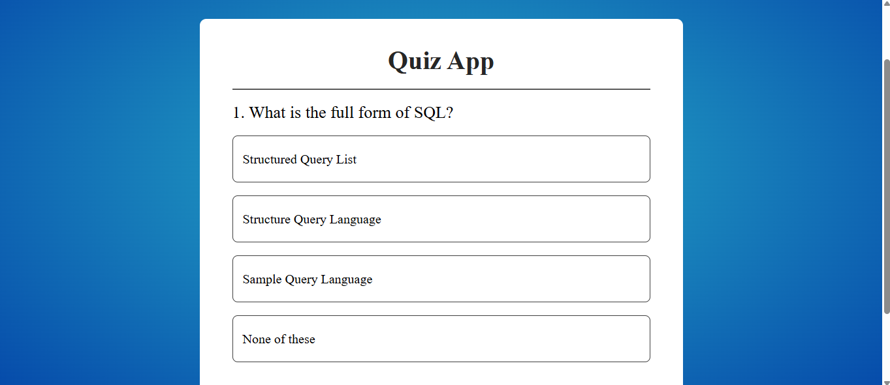
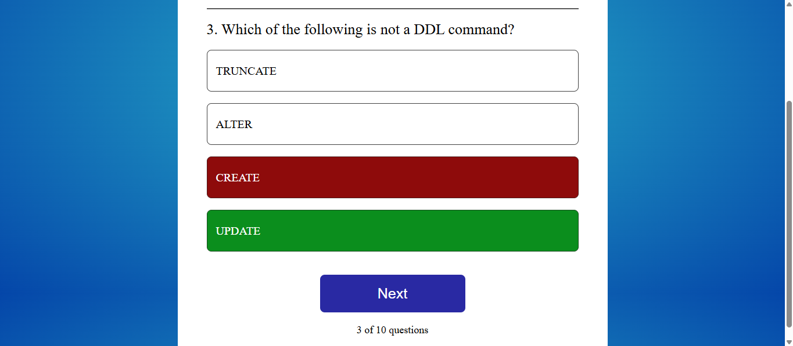
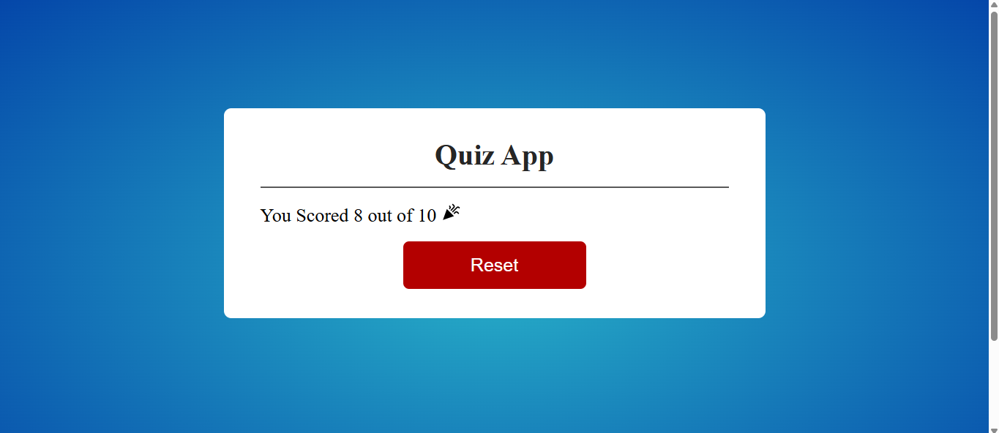

# React Quiz App

A simple multiple-choice **Quiz App** built with **React.js**.

## Features
- Dynamic multiple-choice questions
- Interactive answer selection
- Highlights correct & wrong answers
- Progress tracking
- Clean UI with CSS styling

## Screenshot




## Technologies Used
- React.js
- CSS
- JavaScript

## Installation
Follow these steps to run the project locally:

```bash
# Clone the repository
git clone https://github.com/your-username/react-quiz-app.git

# Navigate to the project folder
cd react-quiz-app

# Install dependencies
npm install

# Start the development server
npm run dev


